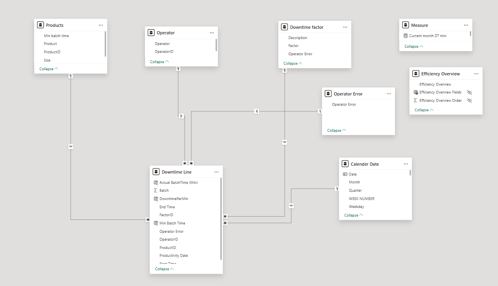
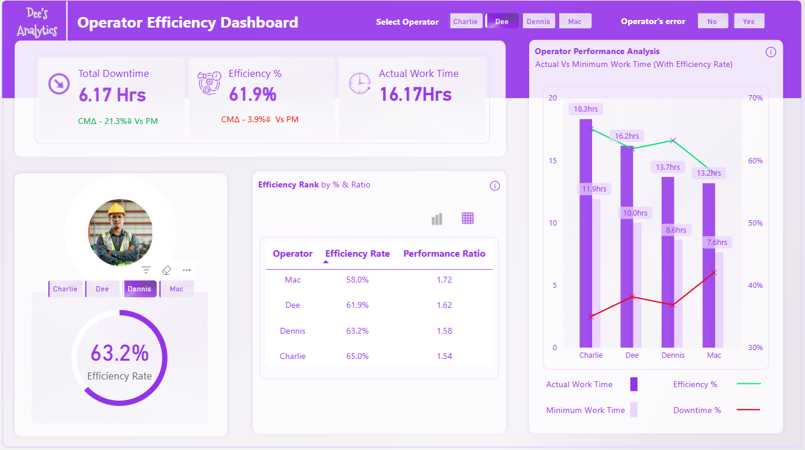

# ⚙️ Operator Efficiency Dashboard (Power BI)

---

> **Power BI dashboard** designed to monitor and compare operator efficiency, downtime, and productivity using **SQL Server** and **Excel** data sources.  
> Combines advanced **data modeling**, **ETL automation**, and **interactive visual analytics** to empower managers with actionable insights for operational improvement.

---

## 🧠 Introduction  
The **Operator Efficiency Dashboard** was developed to analyze operator performance across key production metrics such as downtime, efficiency rate, and work time.  
Its goal is to provide real-time insights that help management optimize workforce productivity, identify bottlenecks, and improve overall operational efficiency.

---

## 🚨 Problem Statement  
The production team lacked real-time visibility into operator performance.  
Manual reporting processes were time-consuming and prone to errors, making it difficult to evaluate efficiency and compare operators effectively.  
A centralized, interactive dashboard was required to automate performance tracking and enhance decision-making.

---

## 🧩 Skills Demonstrated  
- **Data Cleaning & Transformation** using Power Query and SQL  
- **Data Modeling** with Star Schema and DAX measures  
- **Interactive Visualization** in Power BI  
- **KPI Development** (Efficiency %, Downtime %, Performance Ratio)  
- **Analytical Insight Generation** and performance trend analysis  

---

## 🗂️ Data Source  
- **Production and downtime logs** extracted from **Microsoft SQL Server** (primary source for `Downtime Line` fact table)  
- Supplementary datasets from **Excel/CSV files**, including:  
  - **Product details** (batch time, size)  
  - **Operator records** (operator names and IDs)  
  - **Downtime factor descriptions** and **operator error classifications**  
  - **Calendar table** for time-based aggregation  

---

## 🔄 Data Transformation  
- Performed data cleaning and integration using **Power Query**  
- Standardized field names and data types across all source tables  
- Removed null and duplicate records to ensure data quality  
- Established relational keys (`ProductID`, `OperatorID`, `FactorID`, `Date`) for model linking  
- Created calculated fields to enhance performance analysis, including:  
  - `ActualBatchTime (Min)` — total runtime per batch  
  - `DowntimePerMin` — downtime per minute  
  - `Min Batch Time` — standard minimum batch duration  
  - `Efficiency %` — ratio of actual performance vs. expected performance  
- Merged multiple source tables into a consolidated **FactDowntimeLine** table to support efficiency and downtime reporting  

---
 

---

## 🧱 Data Modeling  
This data model supports key performance insights such as:
- Total and average **downtime per operator**
- **Efficiency trends** by product, date, and factor
- Root-cause analysis using **downtime factors** and **operator errors**

The model follows a **Star Schema architecture** to ensure optimized querying and scalable analytics within Power BI.

  

---

## 🗂 Fact Table

### **FactDowntimeLine**
Stores key production metrics and links to all dimension tables.

| Column | Description |
|:--------|:-------------|
| `ProductID` | Links to Product dimension |
| `OperatorID` | Links to Operator dimension |
| `FactorID` | Links to Downtime Factor dimension |
| `Operator Error` | Links to Operator Error dimension |
| `Productivity Date` | Links to Date dimension |
| `ActualBatchTime (Min)` | Actual production time in minutes |
| `DowntimePerMin` | Downtime per minute |
| `Min Batch Time` | Minimum expected batch time |
| `Batch` | Batch identifier |
| `Start Time`, `End Time` | Batch runtime details |

---

## 🧩 Dimension Tables

| Table | Description |
|:--------|:-------------|
| **DimProduct** | Product attributes such as name, size, and minimum batch time |
| **DimOperator** | Operator details for performance tracking |
| **DimDowntimeFactor** | Categorization of downtime causes |
| **DimOperatorError** | Classification of operator errors |
| **DimDate** | Calendar structure for time-based analysis |

---

**Key DAX Measures:**  
- **Efficiency Rate** = DIVIDE([Minimum Time], [Actual Time]) * 100  
  *Measures how efficiently operators complete tasks relative to the expected time.*

- **Performance Ratio** = DIVIDE([Actual Time], [Minimum Time])  
  *Indicates how actual work time compares to the target time; lower ratios represent higher efficiency.*

- **Downtime %** = DIVIDE([Downtime], [Total Work Time]) * 100  
  *Shows the percentage of total time lost due to operational or system issues.*

## 📊 Analysis & Visualization  

The **Operator Efficiency Dashboard** provides an interactive and data-driven view of workforce performance, combining visual storytelling with quantitative analysis.  

  

### 🔍 Key Analytical Components  

**1. KPI Overview**  
- **Total Downtime (hrs):** Tracks the total hours lost to operator or system inefficiencies.  
- **Efficiency %:** Measures productivity by comparing actual vs. expected work time.  
- **Actual Work Time (hrs):** Summarizes the total productive time logged by operators.

  

**2. Operator Comparison**  
- Displays individual **Efficiency Rate** and **Performance Ratio** for each operator.  
- Operators can be filtered (Charlie, Dee, Dennis, Mac) to analyze personal metrics.  
- Dynamic ranking cards visualize who performs best based on Efficiency %.  

  
  
   

**3. Trend and Correlation Analysis**  
- A combined **bar and line chart** shows *Actual vs. Minimum Work Time* with Efficiency % overlay.  
- **Downtime %** trend line highlights the relationship between lost hours and overall efficiency.  
- **Insight Tooltips** explain complex metrics such as the inverse relationship between Efficiency % and Performance Ratio.

💡 **Key Insight:**  
Higher **Efficiency %** corresponds to a lower **Performance Ratio**, meaning tasks are completed faster and more effectively.

---

## 🧭 Conclusion & Recommendations  

### ✅ **Key Findings**  
- Operators **Charlie** and **Dennis** consistently showed higher efficiency and lower downtime.  
- Average **Efficiency Rate** improved to **~62%**, while **Total Downtime** dropped by **21%** compared to the previous measurement period.  
- A strong inverse relationship exists between **Efficiency %** and **Performance Ratio**, confirming that time optimization directly impacts productivity.

### 🧩 **Recommendations**  
- **Sustain high performance:** Continue reinforcing best practices among top-performing operators.  
- **Target improvement areas:** Provide coaching and workflow support for operators below the efficiency threshold.  
- **Automate reporting:** Schedule **Power BI data refreshes** for near real-time visibility.  
- **Expand analytics scope:** Incorporate machine-level efficiency data and production cost metrics for end-to-end operational analysis.  

📈 **Impact:**  
This dashboard transformed manual performance reporting into a self-service analytical tool, improving data accessibility and enabling management to make faster, evidence-based decisions.

